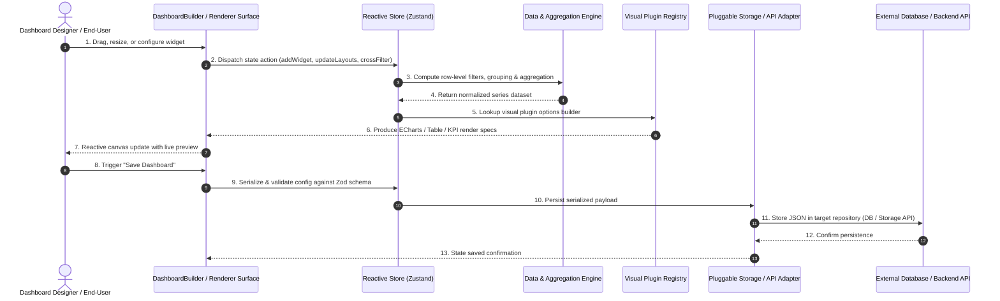

<div align="center">

<a href="https://novexel.co.uk" target="_blank">
  
</a>

# @novexel/dashboarder

### Enterprise-Grade Analytics Dashboard Builder & Visualization Studio

[](LICENSE)
[](https://novexel.co.uk)
[](https://github.com/OWASP/cve-lite-cli)
[](#)
[](#)

[**Novexel Technologies**](https://novexel.co.uk) • London, United Kingdom  
*Engineering secure software solutions, enterprise cloud infrastructure, and cybersecurity services globally.*

---

</div>

## 📌 Executive Summary

**`@novexel/dashboarder`** is an enterprise-grade, extensible analytics dashboard builder and data visualization engine engineered for modern web applications. 

Designed by the software engineering team at **[Novexel](https://novexel.co.uk)**, this package provides a complete drag-and-drop studio (`DashboardBuilder`), a headless read-only viewer (`DashboardRenderer`), a pluggable visual catalog (supporting over 30 visualization archetypes powered by Apache ECharts), granular per-element styling, and an in-memory transformation/cross-filtering engine.

> [!IMPORTANT]
> **Open Source & AI-Agent Friendly:** Released under the permissive **MIT License**. Clean interfaces, explicit types, and strict dependency inversion enable human developers and AI coding agents to drop this package into multi-tenant SaaS portals or enterprise reporting suites without framework lock-in.

---

## 🏛️ Architecture & Lifecycle Data Flow

The package decouples user interactions from storage and data ingestion using dependency inversion and a centralized reactive store:



---

## 🚀 Key Features

* **30+ Visual Archetypes**: Pre-configured support for Line, Bar, Stacked Bar, Area, Pie, Donut, Scatter, Bubble, Heatmap, Sunburst, Treemap, Tree, Gauge, Funnel, Radar, Mindmap, KPI Cards, Data Tables, and Rich Text annotations.
* **Drag-and-Drop Canvas**: Responsive 12-column grid layout powered by `react-grid-layout` with fluid resizing, pan, zoom, alignment, and layer hierarchy management.
* **Pluggable Visual Registry**: Dynamically register custom organizational charts, 3D visualizations, or proprietary graphics via `registerVisual()` and `unregisterVisual()`.
* **Zero-Leak Ingestion Engine**: Support for CSV parsing, JSON records, and REST API connectors with explicit authentication providers (Bearer, Basic, ApiKey).
* **Multi-Dimensional Data Engine**: On-the-fly filtering (`equals`, `inList`, `between`, date ranges), multi-level sorting with null handling, aggregations (`sum`, `average`, `median`, `min`, `max`, `count`), and cross-filtering between linked widgets.
* **Granular Typography & Styles**: Independent font-size sliders for titles, subtitles, axes, legends, tooltips, KPI values, and table cells, with dark mode auto-adaptation.
* **Pluggable Persistence**: Implement `DashboardStorageAdapter` to persist dashboards to PostgreSQL, MongoDB, Prisma, DynamoDB, or REST backends.

---

## 📦 Installation

```bash
npm install @novexel/dashboarder
```

### Peer Dependencies
Ensure your project has React installed:
```bash
npm install react react-dom
```

### CSS Import
Import the bundled grid styling and handle styles in your app entrypoint:
```typescript
import '@novexel/dashboarder/styles.css'
```

---

## 💻 Quickstart

### 1. Interactive Builder Mode (`DashboardBuilder`)

```tsx
import React, { useState } from 'react'
import {
  DashboardBuilder,
  type DashboardConfig,
  type DataSource,
} from '@novexel/dashboarder'
import '@novexel/dashboarder/styles.css'

const dataSources: DataSource[] = [
  {
    id: 'sales-ds',
    name: 'Sales Ledger',
    type: 'static',
    fields: [
      { name: 'region', label: 'Region', type: 'string' },
      { name: 'revenue', label: 'Revenue', type: 'currency' },
    ],
    rows: [
      { region: 'EMEA', revenue: 450000 },
      { region: 'APAC', revenue: 780000 },
      { region: 'AMER', revenue: 920000 },
    ],
  },
]

export function DashboardEditor() {
  const [config, setConfig] = useState<DashboardConfig | undefined>()

  return (
    <div style={{ height: '100vh', width: '100%' }}>
      <DashboardBuilder
        dataSources={dataSources}
        initialConfig={config}
        onSave={(savedConfig) => {
          console.log('Saved dashboard configuration:', savedConfig)
          setConfig(savedConfig)
        }}
      />
    </div>
  )
}
```

### 2. Read-Only Embedded Mode (`DashboardRenderer`)

```tsx
import React from 'react'
import { DashboardRenderer, type DashboardConfig, type DataSource } from '@novexel/dashboarder'
import '@novexel/dashboarder/styles.css'

export function LiveReportView({ config, dataSources }: { config: DashboardConfig; dataSources: DataSource[] }) {
  return (
    <div className="report-container">
      <DashboardRenderer
        config={config}
        dataSources={dataSources}
      />
    </div>
  )
}
```

### 3. Registering Custom Visual Plugins

```typescript
import { registerVisual, type VisualPlugin } from '@novexel/dashboarder'

const customAlertVisual: VisualPlugin = {
  id: 'sla-alert-indicator',
  name: 'SLA Status Indicator',
  category: 'Monitoring',
  renderer: 'custom',
  requiredMappings: [
    { key: 'uptime', label: 'Uptime %', required: true, acceptedTypes: ['percentage', 'number'] },
  ],
  defaultSize: { w: 3, h: 2 },
  compatibleFieldTypes: [
    { mappingKey: 'uptime', acceptedTypes: ['percentage', 'number'] },
  ],
}

registerVisual(customAlertVisual)
```

---

## 🛡️ Security Architecture & Threat Model

`@novexel/dashboarder` enforces defense-in-depth principles across data ingestion, rendering, and persistence boundaries:

### Threat Model Matrix

| Threat Vector | Risk Description | Architectural Mitigation | Integrator Responsibility |
|---|---|---|---|
| **Malicious Config Injection (XSS)** | Untrusted dashboard JSON attempting script injection via title, tooltips, or rich text | Strict Zod schema validation (`dashboardConfigSchema`); React JSX encoding prevents DOM injection; rich text HTML is sanitized | Do not evaluate raw dashboard properties in unsafe `eval()` contexts |
| **SSRF via API Connector** | User configures API connector to probe internal metadata or network endpoints (`http://169.254.169.254`, `file://`) | `ApiConnectorFetchHandler` interface validates protocol whitelist (`http:`, `https:`), rejects dangerous schemes | Route external API requests through an authenticated backend proxy |
| **Client-Side Denial of Service** | Unbounded row sets (>500,000 items) freezing browser thread | Query limits (`limit`), efficient aggregation pipelines, and worker-isolated ingestion support | Enforce server-side aggregation and database pagination for massive enterprise datasets |
| **Cross-Tenant Data Leakage** | Cached filters or widgets exposing records from another tenant | Cross-filters and data states are scoped strictly by isolated `dataSourceId` keys | Ensure backend API endpoints enforce tenant isolation authorization checks |
| **Credential / Token Exposure** | Plaintext API tokens or passwords saved in serialized dashboard JSON | Decoupled connector configuration: persistence strips or externalizes authorization headers | Store API credentials in secure HTTP-only cookies or secret vaults rather than dashboard JSON configs |

---

## 🔌 Storage Adapter Contract

Integrators can plug in custom databases (PostgreSQL, MongoDB, Supabase, Prisma, DynamoDB) by implementing `DashboardStorageAdapter`:

```typescript
import type { DashboardStorageAdapter, DashboardConfig, DataSource } from '@novexel/dashboarder'

export class DatabaseDashboardAdapter implements DashboardStorageAdapter {
  constructor(private readonly apiEndpoint: string) {}

  async save(storageKey: string, payload: { config: DashboardConfig; dataSources: DataSource[] }): Promise<void> {
    await fetch(`${this.apiEndpoint}/${storageKey}`, {
      method: 'PUT',
      headers: { 'Content-Type': 'application/json' },
      body: JSON.stringify(payload),
    })
  }

  async load(storageKey: string): Promise<{ config: DashboardConfig; dataSources: DataSource[] } | null> {
    const res = await fetch(`${this.apiEndpoint}/${storageKey}`)
    if (!res.ok) return null
    return res.json()
  }
}
```

---

## 🧪 Testing & Quality Assurance

Run the comprehensive automated regression suite:

```bash
npm test
```

The test suite validates:
* In-memory aggregation engine (`sum`, `average`, `min`, `max`, `count`)
* Sorting logic with strict null/undefined bottom placement
* Complex filtering operators (`equals`, `inList`, `between`, date operations)
* Zustand state store reactivity, cross-filter dispatching, and widget targeting
* Zod runtime schema validation and legacy dashboard configuration migrations
* Dynamic visual plugin registration and catalog queries
* File parsing and SSRF protocol guardrails

---

## 🔒 Security Audit Verification

This module has been scanned and verified with zero known CVEs:

```bash
npm run security-scan
# npx -y cve-lite-cli@latest . --verbose --check-overrides
# Scan complete. 0 known vulnerabilities found.

npm audit
# found 0 vulnerabilities
```

---

## 🏢 About Novexel

[**Novexel Tech Limited**](https://novexel.co.uk) is a London-based technology consultancy delivering custom enterprise software engineering, cloud architecture, and cybersecurity services for organizations globally.

- **Website:** [https://novexel.co.uk](https://novexel.co.uk)
- **Email:** [info@novexel.co.uk](mailto:info@novexel.co.uk)
- **Headquarters:** First Floor Office, 3 Hornton Place, London, W8 4LZ, United Kingdom

---

## 📄 License

Distributed under the **MIT License**. Copyright (c) 2026 **Novexel Tech Limited**.

---

Novexel Tech Limited • First Floor Office, 3 Hornton Place, London, W8 4LZ, UK • [https://novexel.co.uk](https://novexel.co.uk/) • [info@novexel.co.uk](mailto:info@novexel.co.uk)
